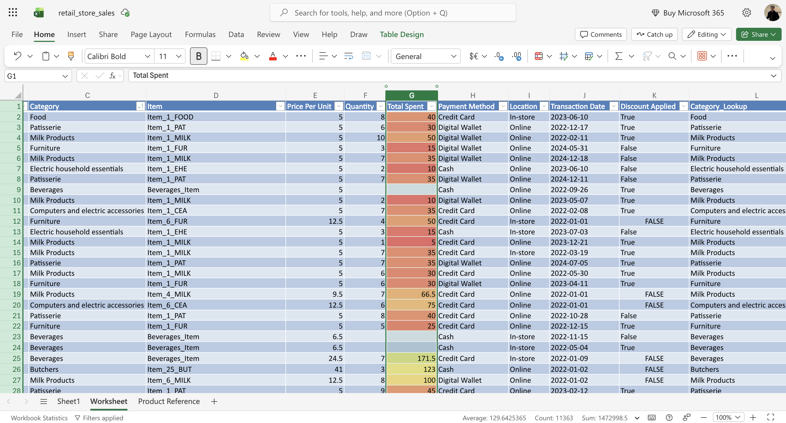
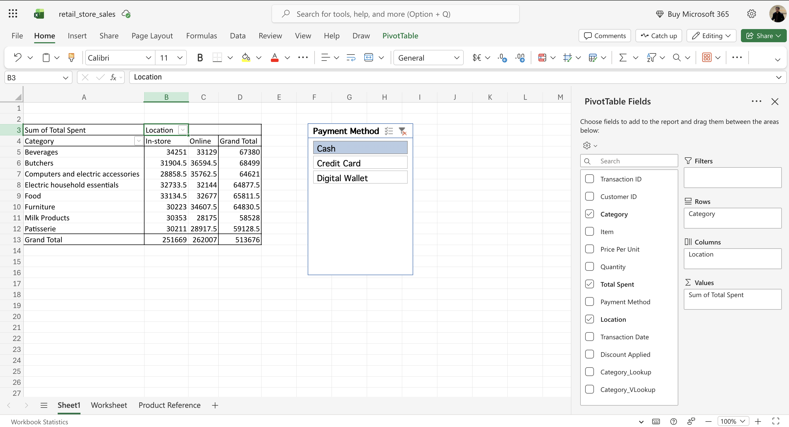
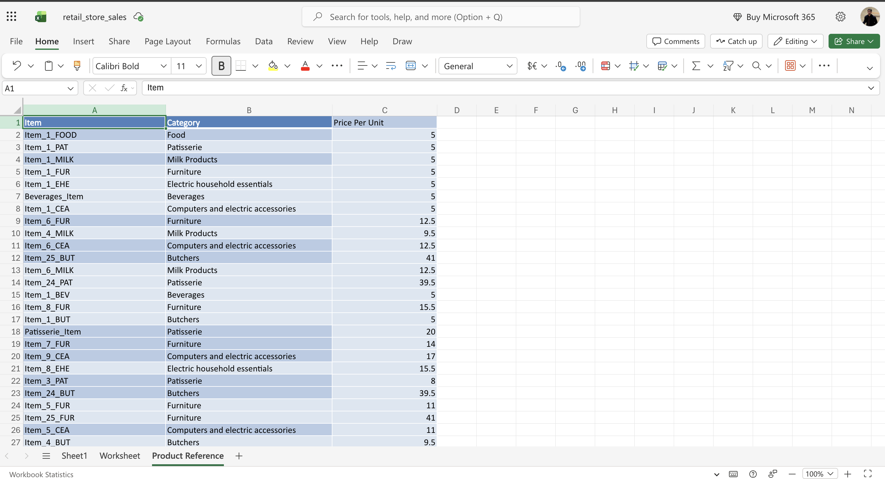

# 🛒 Retail Sales Data Cleaning & Analysis — Excel


A complete data cleaning and analysis project on 12 months of retail point-of-sale data, performed entirely in **Excel Online (Microsoft 365 Free)** — no Python, no Power Query, no paid tools.

---

## 📸 Project Screenshots

### Cleaned Worksheet — Conditional Formatting + XLOOKUP


### PivotTable Dashboard — Revenue by Category × Location


### Product Reference Sheet — Normalised Lookup Table


---

## 📊 The Problem

A retail business exported 12 months of POS data to Excel. The raw file had **12,575 rows** but was unusable for reporting:

| Issue | Impact |
|---|---|
| ~1,200 rows with blank Item names | Category breakdowns unreliable |
| 609 rows with blank Price, Qty, and Total simultaneously | Revenue totals mathematically wrong |
| 4,212 blank Discount Applied flags | Discount analysis impossible |
| No product master list | No way to validate item names or prices |

---

## 🔍 Data Quality — Before vs After

| Metric | Raw | Cleaned |
|---|---|---|
| Total rows | 12,575 | 11,966 |
| Rows removed (unrecoverable nulls) | — | 609 |
| Blank Item cells | ~1,200 (9.6%) | 0 |
| Blank Discount Applied | ~4,212 (33.4%) | 0 |
| Product Reference table | None | 208 unique items |
| Revenue (verifiable) | Unknown | **$1,472,998.50** |

---

## 🛠️ Methodology — 10-Step Process

### Step 1 — Format as Table
Converted raw data to a structured Excel Table (`Ctrl+T`). This enables named column references, auto-expanding formulas, and PivotTable compatibility.

### Step 2 — Duplicate Check
Ran **Remove Duplicates** across all 11 columns → confirmed **0 true duplicates**. Rules out double-entry errors before any cleaning begins.

### Step 3 — Null Deletion
Identified 609 rows where **Price Per Unit, Quantity, and Total Spent were all simultaneously blank** — an interdependent gap that cannot be recovered mathematically. Deleted these rows to protect aggregate accuracy.

> Kept rows where only one of the three was blank (recoverable via formula).

### Step 4 — Null Imputation (Items)
For ~1,200 rows with blank Item names: filtered by Category, selected all blank cells in the Item column, then used `Ctrl+Enter` to bulk-fill with a category-based label (e.g. `Food_Item`, `Beverages_Item`). Repeated for all 8 categories.

> Labels are deliberately distinct from real item names so they're easy to filter out in downstream analysis.

### Step 5 — Boolean Standardisation
Filled **4,212 blank Discount Applied cells** with `FALSE` — a safe business-logic default meaning "no discount was recorded." Used Filter → select blanks → `Ctrl+Enter`.

### Step 6 — Product Reference Sheet
Built a normalised lookup table with **208 unique Item + Category + Price rows**:
1. Copied the cleaned Worksheet to a new sheet
2. Kept only Item, Category, Price Per Unit columns
3. Ran Remove Duplicates on Item + Category
4. Re-attached prices via XLOOKUP formula (avoids price variance from the original data)

### Step 7 — XLOOKUP
Added `Category_Lookup` column to the Worksheet:
```excel
=XLOOKUP(D2,'Product Reference'!A:A,'Product Reference'!B:B,"Not Found")
```
Cross-references each transaction's Item against the Product Reference sheet. Returns the canonical Category or "Not Found" for any unmatched items.

### Step 8 — VLOOKUP
Added `Category_VLookup` column using legacy syntax for backwards compatibility with Excel 2016 and earlier:
```excel
=VLOOKUP(D2,'Product Reference'!A:B,2,0)
```
Running both in parallel demonstrates knowledge of both functions and their trade-offs.

### Step 9 — PivotTable + Slicer
Built a **Category × Location revenue summary** PivotTable on Sheet1:
- Rows: Category (8 categories)
- Columns: Location (In-store / Online)
- Values: Sum of Total Spent
- Slicer: Payment Method (Cash / Credit Card / Digital Wallet)

Total verified revenue: **$513,676** (Cash only) | **$1,472,998.50** (all payment methods)

### Step 10 — Conditional Formatting
Applied a **Green–Yellow–Red colour scale** to the Total Spent column. High-value transactions ($100+) appear green; low-value (under $20) appear red. No filtering required to spot outliers.

---

## 📁 Repository Structure

```
retail-sales-data-cleaning/
├── README.md
├── data/
│   └── retail_store_sales_raw.csv       ← original unmodified dataset (Kaggle)
├── output/
│   └── retail_store_sales_clean.xlsx    ← final cleaned workbook (add manually)
├── docs/
│   └── Excel_Portfolio_Case_Study.docx  ← full written case study
└── screenshots/
    ├── 01_worksheet_conditional_formatting.png
    ├── 02_pivot_table_slicer.png
    └── 03_product_reference.png
```

---

## 📈 Key Findings

- Total verified revenue across 11,966 transactions: **$1,472,998.50**
- Online sales ($262,007) slightly outpaced In-store sales ($251,669)
- **Butchers** had the highest average transaction value due to premium item prices ($41)
- **Beverages** had the highest volume of transactions
- Cash was the least-used payment method across all categories

---

## 🧰 Excel Skills Demonstrated

| Skill | Category |
|---|---|
| Format as Table | Data Structuring |
| Remove Duplicates | Deduplication |
| Filter + Sort | Navigation & Selection |
| Ctrl+Enter bulk-fill | Efficient Data Entry |
| XLOOKUP (cross-sheet) | Lookup & Reference |
| VLOOKUP (legacy) | Lookup & Reference |
| PivotTable | Data Summarisation |
| Slicer | Interactive Filtering |
| Conditional Formatting (colour scale) | Data Visualisation |
| Data Normalisation (Reference sheet) | Database Design |

---

## 📂 Dataset

- **Source:** [Retail Store Sales — Kaggle](https://www.kaggle.com/datasets/ahmedmohamed2003/retail-store-sales-dirty-for-data-cleaning)
- **Rows:** 12,575 | **Columns:** 11
- **Period:** 2022–2024
- **Columns:** Transaction ID, Customer ID, Category, Item, Price Per Unit, Quantity, Total Spent, Payment Method, Location, Transaction Date, Discount Applied

---

## 👤 Author

**Muntasir Md. Nafis** — Data Analyst  
· [LinkedIn](https://www.linkedin.com)

---

*All work performed in Excel Online (Microsoft 365 Free — no Power Query, no macros, no Python).*
